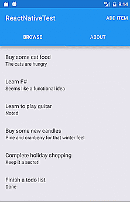
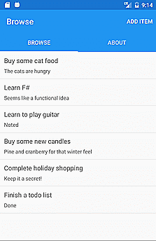
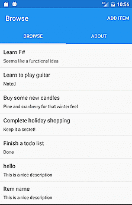

# ReactNativeTest

Just messing with React Native's default app. Noticed that the Xamarin Forms default app was a little more in-depth so figured I'd try to copy some of the functionality.

## Starting with Android
First thing I noticed was that there was no TabLayout component as part of the default React Native component library.  After searching around for a user created a component I noticed a lot of people don't actually create native components, they just created native looking elements from JavaScript based on existing components like views using animations.  Not very happy with what I saw I decided I'd see what was involved in creating a TabLayout component over the bridge.

During this exercise I have found some other people have created TabLayout components but they either bundle with more components or they seem to be more complicated than they needed to be.  I'll eventually look at pulling the component out into my own 3rd party lib or maybe contributing it back to the main project one day.

*Example of native TabLayout component over the bridge comparing React Native to Xamarin test project*

 

Decided to explore navigation next.  Grabbed the [react-navigation](https://reactnavigation.org/) library and started to wire it in.  Not sure what I think of it just yet. Titanium/[Appcelerator](http://www.appcelerator.org/) felt like they had the navigation nailed down really well when I was using it and not sure why React Native doesn't feel as good.

*Example of the navigation comparing the React Native to Xamarin test project*

 

Just messing with setState and updating the action buttons when swiping the view pager.

*Example of updating state while swiping view pager*

 

## Continuing with iOS
Generally I'd do both of these at the same time but I don't currently have a Mac or an iPhone so I'll get to it later.